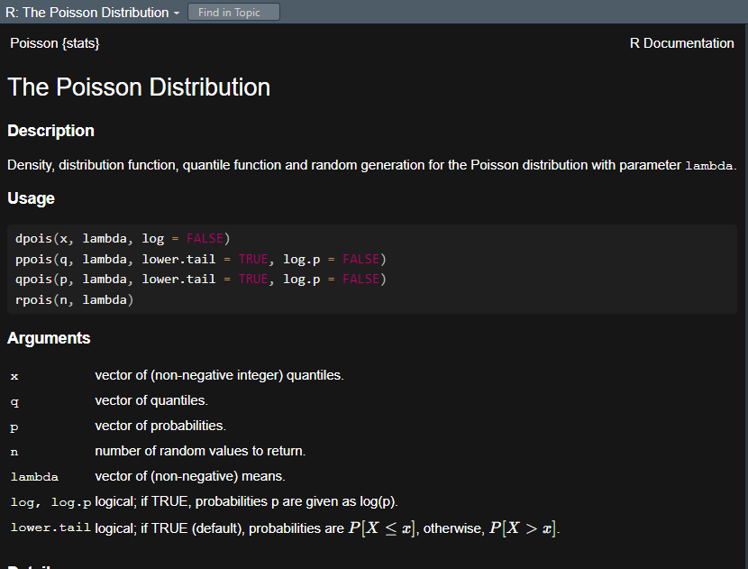

---
output:
  pdf_document: default
  html_document: default
---
```{r setup, include=FALSE}
knitr::opts_chunk$set(echo = TRUE)
```


### Question 3

Answer 3.a:

Given code for Matrix A:

```{r}
rm(list=ls())
A <- matrix(rpois(64,5), 8, 8)
A
```

After looking for rpois() help using ?rpois we see the following


{width=50%}

Here are things happening in the give code:

1. rm(list=ls()): This line clears the workspace, removing any existing variables.

2. A <- matrix(rpois(64, 5), 8, 8): This line generates a matrix A with dimensions 8 x 8. 

3. It uses the rpois() function, which generates random values from the Poisson distribution. The function takes two arguments: the number of values to generate (in this case, 64) and the mean parameter (in this case, 5). So, each element of matrix A is obtained by generating a random Poisson-distributed value with a mean of 5.

### Question 3

Answer 3.b:

Here is the given code for matric C:

```{r}

C= A %*% t(A)
C
```


To generate  eigen values and eigenvectors of matrix:

```{r}
# eigenvalues and eigenvectors
eigen_result <- eigen(C)
```


Eigenvalues:

```{r}
print(eigen_result$values)
```


Eigenvectors:

```{r}
print(eigen_result$vectors)
```


### Question 3

Answer 3.c:

Since all of the eigenvalues of matrix C are positive, we can conclude that matrix C is positive definite.

### Question 3

Answer 3.d:


Transferring the values of eigenvectors in a variable U
```{r}

U <- eigen_result$vectors

# Creating U transpose
U_transpose <- t(U)

#U*U_transpose product
U_product <- U %*% U_transpose

# Identity matrix of the same size as U_product
I <- diag(nrow(U_product))

# View the product
U_product
```

By looking at the product matrix all the diagonal elements are 1 and non-diagonal elements are close to zero (the values are significantly low). Hence we have verified that $U^T*U=I$ Where $I$ is the unit matrix.

### Question 3

Answer 3.e:

Since it isn't clearly mentioned on which matrix should we apply SVD on I am applying SVD on both matrix A and Matrix C

For matrix A:

```{r}
# Calculate the SVD
svd_result <- svd(A)

# Extract the matrices U, D, and V from svd_result
U <- svd_result$u
D <- diag(svd_result$d)  # Create a diagonal matrix from singular values
V <- svd_result$v

# Verify that A = U * D * t(V)
reconstructed_A <- U %*% D %*% t(V)

# Check if the reconstructed_C is close to the original C (within a tolerance)
is_equal <- all.equal(A, reconstructed_A)

# Print the result of verification
if (is_equal) {
  cat("SVD verification: Succeeded\n")
} else {
  cat("SVD verification: Failed\n")
}
```


For Matrix C:

```{r}
# Calculate the SVD
svd_result <- svd(C)

# Extract the matrices U, D, and V from svd_result
U <- svd_result$u
D <- diag(svd_result$d)  # Create a diagonal matrix from singular values
V <- svd_result$v

# Verify that C = U * D * t(V)
reconstructed_C <- U %*% D %*% t(V)

# Check if the reconstructed_C is close to the original C (within a tolerance)
is_equal <- all.equal(C, reconstructed_C)

# Print the result of verification
if (is_equal) {
  cat("SVD verification: Succeeded\n")
} else {
  cat("SVD verification: Failed\n")
}

```
